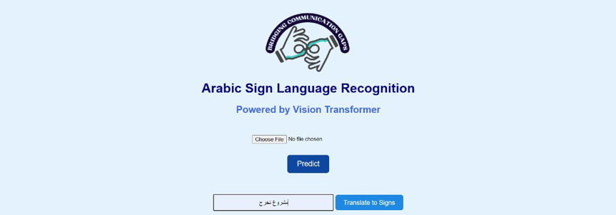
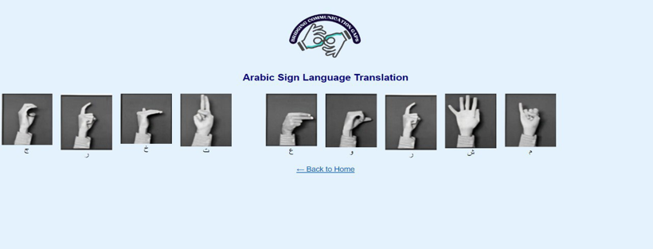

# Bridging Communication Gaps: A System for Text to Arabic Sign Language Translation

## Project Overview

This graduation project presents an **Arabic Sign Language (ArSL) recognition and translation system** designed to improve accessibility for the Arabic-speaking Deaf and hard-of-hearing community.

The system combines deep learning and a web application to support two main functions:

1. **Sign Language Recognition**  
   The user can upload an image of an Arabic Sign Language hand gesture. The system processes the image using a trained deep learning model and predicts the corresponding Arabic letter.

2. **Arabic Text to Sign Language Translation**  
   The user can enter Arabic text, and the system converts each Arabic character into its corresponding Arabic Sign Language image and displays the signs from right to left.

The project was developed as a graduation project at **Princess Nourah bint Abdulrahman University (PNU)**.

---

## Project Goal

The main goal of the project is to help bridge the communication gap between Arabic text and Arabic Sign Language by providing an accessible and easy-to-use system for sign recognition and text-to-sign translation.

The system focuses on static Arabic Sign Language gestures at the individual letter level.

---

## Dataset

The project used the **ArASL Images Dataset** from Mendeley Data.

The dataset contains:

- **54,049 images**
- Static Arabic Sign Language gestures
- Different gesture samples, angles, and variations

Before training, several data preparation steps were applied, including:

- Exploratory Data Analysis (EDA)
- Image preprocessing
- Image resizing
- Data augmentation
- Class balancing

The dataset is not included in this repository due to its large size.

---

## Models

Four deep learning models were developed and evaluated:

- Convolutional Neural Network (CNN)
- MobileNetV2
- Capsule Network (CapsNet)
- Vision Transformer (ViT)

The models were compared using accuracy, precision, recall, F1-score, and test loss.

### Model Comparison

| Model | Test Accuracy |
|---|---:|
| CNN | 97.84% |
| MobileNetV2 | 92.39% |
| CapsNet | 83.27% |
| **Vision Transformer (ViT)** | **98.78%** |

The **Vision Transformer (ViT)** achieved the best overall performance and was selected as the final model for the system.

---

## ViT Training Configuration

The final Vision Transformer model was based on the pre-trained `vit_base_patch16_224` architecture from the `timm` library and fine-tuned on the Arabic Sign Language dataset.

| Setting | Value |
|---|---|
| Architecture | ViT Base (Patch16, 224) |
| Pre-trained Model | `vit_base_patch16_224` |
| Input Shape | 224 × 224 × 3 |
| Data Split | 80% Train / 10% Validation / 10% Test |
| Optimizer | AdamW |
| Learning Rate | 0.0001 |
| Batch Size | 32 |
| Epochs | 10 |
| Loss Function | Cross Entropy Loss |

---

## Final Model Results

The Vision Transformer achieved the following results on the test set:

| Metric | Result |
|---|---:|
| Test Accuracy | **98.78%** |
| Test Loss | **0.0394** |
| Precision | **0.99** |
| Recall | **0.99** |
| F1-score | **0.99** |

These results made ViT the best-performing model among the four evaluated architectures.

---

## System Workflow

### Image-to-Letter Recognition

When the user uploads a hand gesture image:

```text
Hand Gesture Image
        ↓
Image Preprocessing
        ↓
Vision Transformer (ViT)
        ↓
Predicted Arabic Letter
        ↓
Confidence Score
        ↓
Corresponding Sign Image
```

### Arabic Text-to-Sign Translation

When the user enters Arabic text:

```text
Arabic Text
     ↓
Character Processing
     ↓
Arabic Letter Mapping
     ↓
Corresponding Sign Images
     ↓
Signs Displayed Right-to-Left
```

---

## Web Application

The final model was integrated into a web application using **Flask**.

The interface was developed using **HTML and CSS** and provides two main features.

### Sign Recognition

The user uploads an Arabic Sign Language gesture image.

The system:

- Preprocesses the uploaded image
- Passes it to the trained ViT model
- Predicts the Arabic letter
- Displays the confidence score
- Shows the corresponding sign image

### Text-to-Sign Translation

The user enters Arabic text or a sentence.

The system:

- Processes each Arabic character
- Maps each character to its corresponding sign image
- Displays the sign images in right-to-left order

---

---

## Deployment Screenshots

### Home Page

The main interface allows users to upload an Arabic Sign Language gesture image for recognition or enter Arabic text for sign translation.



### Sign Recognition Result

The Vision Transformer predicts the Arabic letter from the uploaded hand gesture image and displays the prediction confidence.


### Arabic Text to Sign Language Translation

The system converts Arabic text character by character into the corresponding Arabic Sign Language images and displays them from right to left.



---

## Technologies

### Machine Learning and Deep Learning

- Python
- PyTorch
- Vision Transformer (ViT)
- CNN
- MobileNetV2
- Capsule Network
- timm
- Torchvision
- Scikit-learn

### Data Processing and Analysis

- Pandas
- NumPy
- Pillow
- Matplotlib

### Development and Deployment

- Flask
- HTML
- CSS
- Google Colab
- Visual Studio Code

---

## Repository Structure

```text
arabic-sign-language-translation-system/
│
├── vit_arabic_sign_language.ipynb
├── requirements.txt
├── .gitignore
└── README.md
```

This repository currently contains the Vision Transformer notebook used in the project. Additional deployment files and project components can be added to the repository separately.

---

## Installation

Install the required Python libraries using:

```bash
pip install -r requirements.txt
```

Then open the notebook:

```text
vit_arabic_sign_language.ipynb
```

Update the dataset paths based on your local or Google Colab environment before running the notebook.

---

## Limitations

The current system focuses on **static Arabic Sign Language gestures at the individual letter level**.

It does not currently support:

- Dynamic gestures
- Full word-level sign recognition
- Arabic Sign Language sentence grammar
- Facial expression recognition
- Real-time webcam recognition

---

## Future Work

Future improvements could include:

- Real-time webcam-based gesture recognition
- Dynamic gesture recognition
- Word and phrase-level translation
- Facial expression recognition
- Support for Arabic Sign Language grammar
- Larger vocabulary
- Cloud deployment
- User feedback for continuous model improvement

---

## Conclusion

This project developed an Arabic Sign Language recognition and translation system that combines deep learning with an accessible web interface.

Four deep learning models were evaluated, and the **Vision Transformer achieved the highest test accuracy of 98.78%**.

The project demonstrates how computer vision and deep learning can be used to support accessibility and improve communication between Arabic text and Arabic Sign Language.
